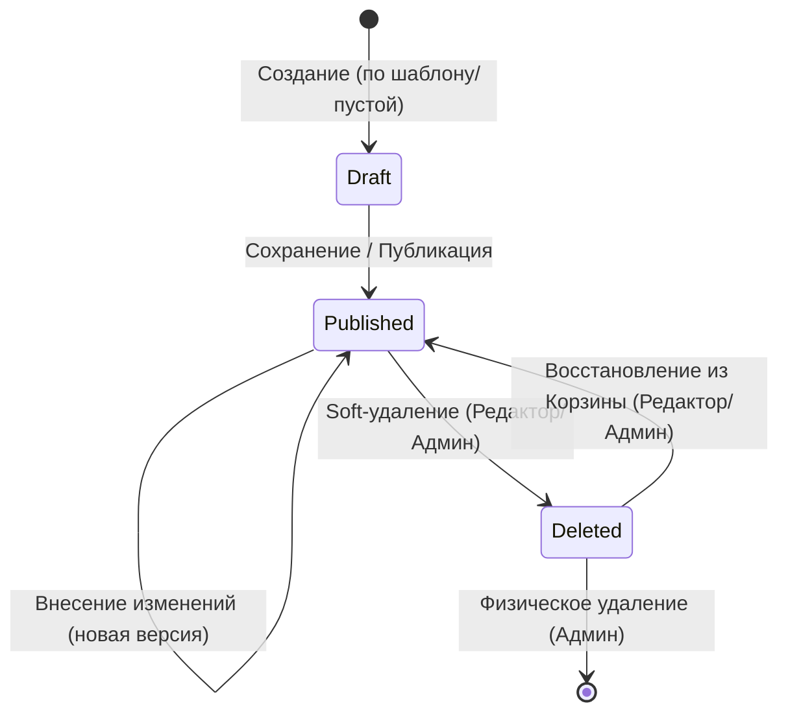

# Сущности и их жизненный цикл (Entities & Lifecycle)

## Основные сущности (Aggregates)

### 1. Документ (Document)
Центральная сущность системы.
* **Атрибуты:** ID, Заголовок, Содержимое (Wiki/MD), Автор, Пространство, Статус, Дата создания, Дата изменения.
* **Связи:** Принадлежит к `Space`, имеет список `Attachment`, имеет историю `Version`.

### 2. Пространство (Space)
Контейнер для документов.
* **Атрибуты:** ID, Название, Описание, Ответственный редактор.
* **Связи:** Содержит множество `Document`, имеет настройки `AccessPolicy`.

### 3. Пользователь (User)
Субъект системы.
* **Атрибуты:** ID, Логин, Пароль (hash), Email, Роль (Admin/Editor/Reader).

### 4. Версия (Version)
Снимок состояния документа.
* **Атрибуты:** ID версии (Git hash), ID документа, Автор правки, Время сохранения, Diff (разница).

### 5. Вложение (Attachment)
Файл, связанный с документом.
* **Атрибуты:** ID, Имя файла, Тип контента, Размер, Ссылка на хранилище.

---

## Жизненный цикл документа

### Описание переходов:
1. **Создание:** Документ инициализируется в статусе `Draft`. На этом этапе он виден только автору.
2. **Публикация:** При первом сохранении или нажатии "Опубликовать" статус меняется на `Published`. Документ становится доступен для поиска и чтения (согласно правам).
3. **Изменение:** Каждое сохранение в статусе `Published` создает новую запись в истории версий (Git), но статус остается прежним.
4. **Soft-удаление:** Документ помечается флагом `is_deleted` или переходит в статус `Deleted`. Он перестает отображаться в общих списках.
5. **Восстановление:** Возврат документа из "Корзины" в активное состояние.
6. **Hard-delete:** Окончательное удаление данных из БД и Git-репозитория.
