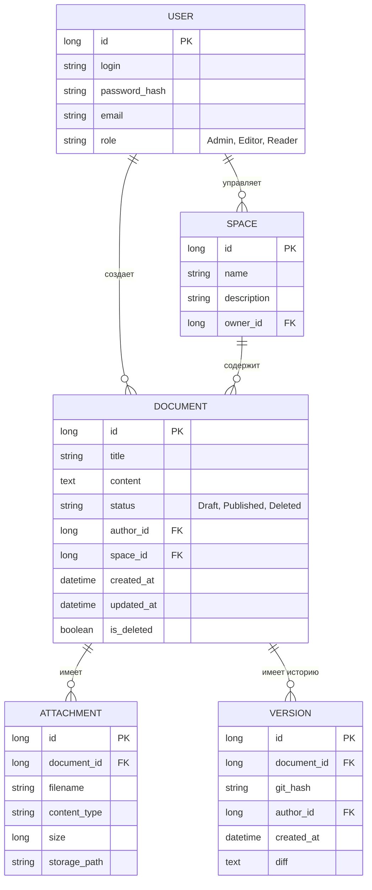

# Моделирование данных (Data Modeling)

## ER-диаграмма (Логическая модель)

## Описание таблиц

### 1. Users
Хранит учетные данные и глобальные роли пользователей.

### 2. Spaces
Определяет логические группы документов. Связана с пользователем-владельцем (ответственным редактором).

### 3. Documents
Основная таблица контента. Поле `status` управляет видимостью, а `is_deleted` используется для Soft-удаления.

### 4. Versions
Служит для связи метаданных документа с физическими коммитами в Git-репозитории. Хранит ссылку на автора правки.

### 5. Attachments
Метаданные файлов. Сами файлы хранятся в файловой системе или объектном хранилище, в БД только путь.
