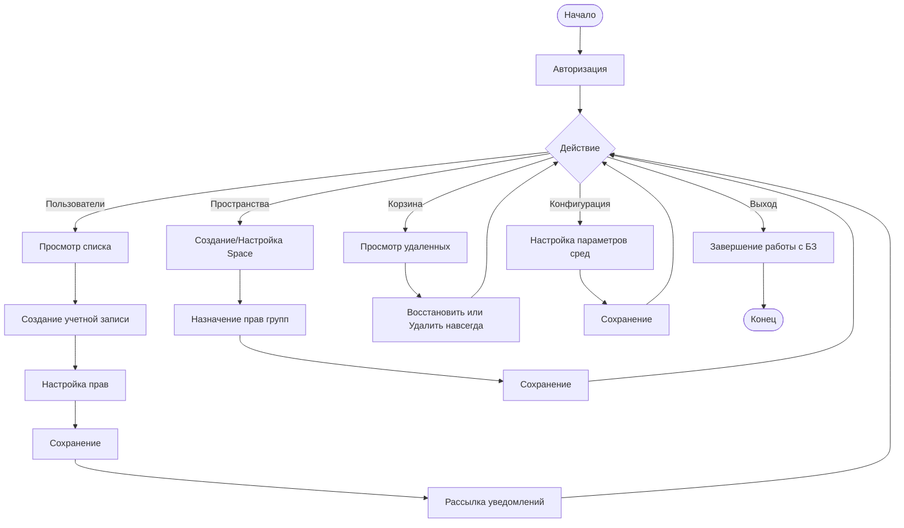
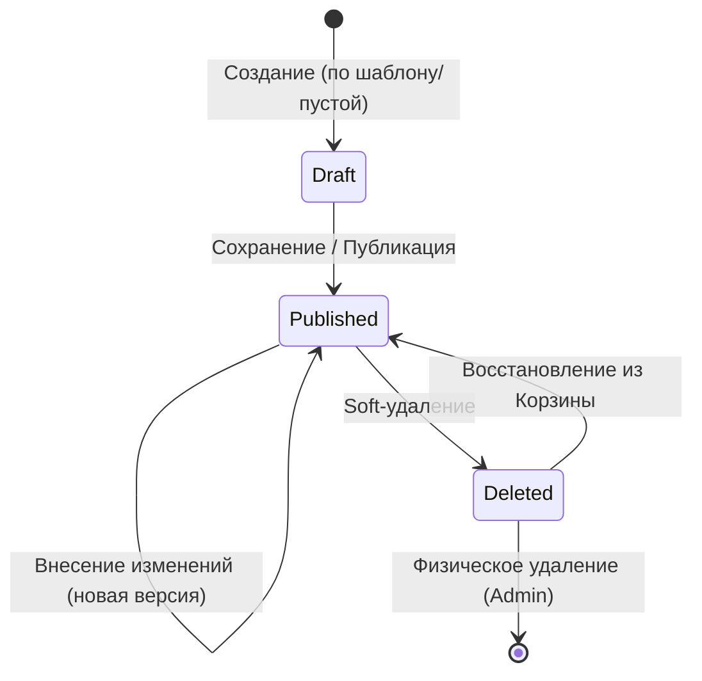

# Требования к системе

## Термины и сокращения

* **БЗ** — База знаний.
* **Пространство (Space)** — логическая группировка документов (по проектам, отделам или темам) с едиными настройками прав доступа.
* **Wiki-разметка** — язык разметки, используемый для оформления текста в документах.
* **CRUD** — (Create, Read, Update, Delete) базовые операции работы с данными: создание, чтение, обновление, удаление.
* **UI** — (User Interface) пользовательский интерфейс.

## Общее описание

База знаний представляет собой веб-приложение, предназначенное для централизованного хранения и управления технической и аналитической документацией. Система позволяет пользователям создавать, редактировать и просматривать документы с использованием Wiki-разметки, а также управлять правами доступа к ним.
[
   - **Требование:** Общее описание системы и Wiki-разметка
   - **Статус:** Покрыто
   - **Элементы бэклога:** [E1, F1.1]
   - **Комментарий:** Основная концепция системы.
]

**Ключевые возможности:**

* **Использование шаблонов:** Наличие предустановленных шаблонов документов для различных ролей (Разработчик, Аналитик, Администратор).
[
   - **Требование:** Использование шаблонов
   - **Статус:** Покрыто
   - **Элементы бэклога:** [F1.2, US1.2.1]
]
* **Работа с документами:** Создание, редактирование и просмотр различных типов документов (архитектура, требования, инструкции, конфигурации).
[
   - **Требование:** Работа с документами
   - **Статус:** Покрыто
   - **Элементы бэклога:** [E1, US1.1.2]
]
* **Навигация:** Система навигации по документам через оглавление и списки.
[
   - **Требование:** Навигация
   - **Статус:** Покрыто
   - **Элементы бэклога:** [E3, US3.2.1]
]
* **Файловые вложения:** Управление вложенными файлами внутри документов.
[
   - **Требование:** Файловые вложения
   - **Статус:** Покрыто
   - **Элементы бэклога:** [F1.3, US1.3.1]
]
* **Версионность:** Ведение истории изменений документов с возможностью сравнения и отката версий.
[
   - **Требование:** Версионность
   - **Статус:** Покрыто
   - **Элементы бэклога:** [E2, F2.2, US2.2.2, US2.2.3, US2.2.4]
]
* **Экспорт:** Возможность выгрузки документов в форматы PDF, DOCX или HTML.
[
   - **Требование:** Экспорт
   - **Статус:** Покрыто
   - **Элементы бэклога:** [E5, F5.1, US5.1.2, US5.1.3, US5.1.4]
]
* **Пространства:** Группировка документов по проектам или отделам с отдельными правами доступа для каждого пространства.
* **Безопасность:** Разграничение прав доступа на уровне пространств, документов и пользователей.
[
   - **Требование:** Безопасность
   - **Статус:** Покрыто
   - **Элементы бэклога:** [E4, F4.1, US4.1.3, US4.2.2]
]

## Описание процессов

На основании анализа бизнес-процессов выделены следующие основные сценарии взаимодействия:

### 1. Процесс со стороны Пользователя (Чтение)

1. **Вход в приложение:** Авторизация в системе.
[
   - **Требование:** Авторизация
   - **Статус:** Покрыто
   - **Элементы бэклога:** [US4.1.2]
]
2. **Получение уведомлений:** Получение рассылок об изменениях в документах или назначении новых прав доступа.
[
   - **Требование:** Уведомления
   - **Статус:** Покрыто
   - **Элементы бэклога:** [F4.3, US4.3.1]
]
3. **Поиск документа:**
    * Поиск по названию или тексту.
[
   - **Требование:** Поиск по названию
   - **Статус:** Покрыто
   - **Элементы бэклога:** [US3.1.1]
]
    * Поиск по дате создания/изменения.
[
   - **Требование:** Фильтрация по дате
   - **Статус:** Покрыто
   - **Элементы бэклога:** [US3.1.2]
]
    * Навигация через иерархическое оглавление.
[
   - **Требование:** Иерархическое оглавление
   - **Статус:** Покрыто
   - **Элементы бэклога:** [US3.2.1]
]
4. **Выбор и просмотр:** Переход к конкретному документу и ознакомление с информацией в нём.
5. **Экспорт документа:** Возможность выгрузки содержимого документа в выбранный формат (PDF, DOCX, HTML).
6. **Продолжение работы:** Возможность вернуться к поиску нового документа или завершить работу.
7. **Завершение работы:** Выход из системы (Logout).

### 2. Процесс со стороны Редактора (Создание и изменение)

1. **Авторизация:** Вход под учетной записью с правами редактора.
2. **Действия с документами:**
    * **Создание:** Выбор пространства -> Выбор типа документа (шаблона) -> Заполнение атрибутов -> Прикрепление файлов -> Сохранение документа (переход из Draft в Published) -> Рассылка уведомлений.
    * **Редактирование:** Поиск существующего документа -> Внесение изменений в информацию -> Сохранение изменений (создание новой версии в Git) -> Рассылка уведомлений.
    * **Управление доступом:** Поиск документа -> Настройка прав доступа для групп или пользователей -> Сохранение прав -> Рассылка уведомлений.
    * **Версионность:** Поиск документа -> Просмотр истории изменений -> Сравнение версий -> При необходимости восстановление (откат) версии -> Рассылка уведомлений.
3. **Удаление (Soft-delete):** Поиск документа -> Пометка документа как удаленного (смена статуса) -> Рассылка уведомлений.
4. **Завершение работы:** Выход из системы (Logout).

### 3. Процесс со стороны Администратора (Управление системой)

1. **Авторизация:** Вход под учетной записью с правами администратора.
2. **Управление пользователями:**
    * Просмотр списка зарегистрированных пользователей.
    * Создание новой учетной записи.
    * Настройка и изменение прав доступа (ролей) -> Сохранение -> Рассылка уведомлений.
3. **Управление пространствами (Spaces):**
    * Создание и настройка параметров пространства.
    * Назначение ответственных редакторов и прав доступа для групп пользователей -> Сохранение.
4. **Обслуживание данных (Корзина):**
    * Просмотр списка удаленных документов.
    * Восстановление документа (возврат в статус Published) или физическое удаление (Hard-delete).
5. **Управление конфигурациями:** Настройка параметров сред и ведение списков доступных ресурсов -> Сохранение.
6. **Завершение работы:** Выход из системы (Logout).

## Требования

### Регистрация и авторизация (все категории)

* **Возможность регистрации:** Система должна предоставлять пользователю и администратору возможность создания новой учетной записи пользователя.
* **Возможность аутентификации:** Система должна обеспечивать вход в систему по паре "логин/пароль".
[
   - **Требование:** Аутентификация по логину/паролю
   - **Статус:** Покрыто
   - **Элементы бэклога:** [US4.1.2]
]

### Управление пользователями и пространствами (администратор)

* **Просмотр списка:** Возможность просмотра списка всех зарегистрированных пользователей.
* **Добавление:** Возможность создания новых учетных записей администратором.
* **Назначение прав:** Назначение ролей и прав доступа пользователям.
* **Управление пространствами:** Создание и настройка пространств (Spaces), назначение ответственных редакторов и прав доступа для групп пользователей на уровне всего пространства.
[
   - **Требование:** Управление пространствами
   - **Статус:** Покрыто
   - **Элементы бэклога:** [F4.2, US4.2.1, US4.2.2]
]

### Создание документа (редактор)

* **Создание:** Пользователь с ролью "Редактор" должен иметь возможность создать документ, заполнив необходимые атрибуты.
* **Прикрепление файлов:** Возможность загружать файлы и прикреплять их к документу.

#### Предоставляемые типы документов

Система предоставляет специализированные шаблоны документов в зависимости от роли пользователя:

**Для роли «Разработчик»:**

1. **Описание архитектуры:** Документирование структурных решений системы.
2. **Используемые библиотеки:**

    * Название
    * Тип
    * Лицензия

3. **Настройки среды разработки:** Описание параметров окружения.

**Для роли «Аналитик»:**

1. **Описания бизнес-процессов:** Документирование логики работы бизнеса.
2. **Требования к системе:**

    * Номер (выставляется автоматически)
[
   - **Требование:** Автонумерация требований
   - **Статус:** Покрыто
   - **Элементы бэклога:** [US1.2.2]
]
    * Название
    * Описание (в формате .md)
    * Связанные файлы

3. **Пользовательская инструкция:** Руководства для конечных пользователей.

**Для роли «Администратор»:**

1. **Конфигурация системы:**

    * Список сред
    * Параметры сред

2. **Доступные среды:** Перечень активных окружений.
3. **Известные проблемы:** База знаний по инцидентам и ошибкам.
4. **Типовые запросы:**

    * Категория пользователя
    * Тип запроса
    * Описание (в формате .md)
    * Файлы

* Возможность сохранить документ.
* **Выбор пространства:** При создании документа редактор должен указать пространство, к которому он относится.
* **Управление доступом:** Автор документа должен иметь возможность открыть к нему доступ другим пользователям или ограничить его (в рамках прав, заданных на уровне пространства).

### Редактирование документа (редактор)

* **Редактирование:** Редактор, имеющий соответствующие права доступа, должен иметь возможность изменить содержимое документа или его атрибуты.
* **Удаление:** Возможность удаления документа пользователем с правами редактора.
* **Разграничение прав (UI):** Система должна скрывать элементы интерфейса (кнопки "Редактировать", "Удалить") от пользователей, не имеющих соответствующих прав на конкретный документ.
* Возможность прикрепления дополнительных документов.
* Возможность сохранения изменений.

### Жизненный цикл документа (Workflow)

Каждый документ в системе проходит определенный жизненный цикл (набор статусов) от момента создания до удаления.

**Статусов документа:**

1. **Черновик (Draft):** Начальный статус. Документ доступен только автору и администраторам. Создается при выборе шаблона или создании пустого документа.
[
   - **Требование:** Статус Draft
   - **Статус:** Покрыто
   - **Элементы бэклога:** [F2.1, US2.1.1]
]
2. **Опубликован (Published):** Документ доступен для чтения всем пользователям, имеющим права доступа к соответствующему пространству. Переход в этот статус происходит после сохранения автором готового черновика или после внесения правок в уже существующий документ.
[
   - **Требование:** Статус Published
   - **Статус:** Покрыто
   - **Элементы бэклога:** [F2.1, US2.1.1]
]
3. **Удален (Deleted / Soft-delete):** Документ скрыт из результатов поиска и списков, но физически остается в базе данных и репозитории Git (корзина).
[
   - **Требование:** Soft-delete
   - **Статус:** Покрыто
   - **Элементы бэклога:** [F2.1, US2.1.2]
]

**Процесс Soft-удаления:**

* При удалении документа редактором, он помечается как удаленный (смена флага/статуса), но не стирается из БД.
* Администратор или Редактор (если есть права) может восстановить документ из "Корзины", вернув его в статус "Опубликован".
* Физическое удаление (Hard-delete) доступно только Администратору или происходит автоматически по истечении заданного периода удержания (опционально для MVP).
[
   - **Требование:** Hard-delete
   - **Статус:** Покрыто
   - **Элементы бэклога:** [US2.1.3]
]

### Версионность документов (все категории)

* **История изменений (Историчность):** Система должна вести историю всех изменений документа с указанием автора правки и времени изменения. Каждое сохранение опубликованного документа создает новую версию в Git.
[
   - **Требование:** Git-история
   - **Статус:** Покрыто
   - **Элементы бэклога:** [US2.2.1, US2.2.2]
]
* **Просмотр версий:** Возможность просмотра любой предыдущей версии документа.
* **Сравнение версий:** Возможность визуального сравнения состояния документа «до» и «после» конкретной правки.
* **Откат изменений:** Возможность восстановления документа до любой из предыдущих версий пользователем с правами редактора.

### Поиск и навигация (все категории)

* **Просмотр списка:** Система должна отображать список документов с поддержкой пагинации (постраничного вывода).
[
   - **Требование:** Пагинация
   - **Статус:** Покрыто
   - **Элементы бэклога:** [US3.1.3]
]
* **Оглавление:** Отображение иерархической структуры документов.
* **Поиск и фильтрация:** Реализация поиска по названию документа и фильтрация по дате создания/изменения или категории. Полнотекстовый поиск не предусмотрен.
* **Импорт данных:** Импорт данных из внешних систем не предусмотрен.

### Экспорт документов (все категории)

* **Форматы выгрузки:** Система должна поддерживать экспорт документов в форматы PDF, DOCX и HTML.
* **Сохранение структуры:** При экспорте должно сохраняться форматирование Wiki-разметки и структура документа.
* **Вложения:** Возможность включения прикрепленных файлов в архив при экспорте (опционально).

### Нефункциональные требования

1. **Производительность:** Время отклика системы при просмотре документа не должно превышать 2 секунд при нормальной нагрузке.
[
   - **Требование:** Производительность (2 сек)
   - **Статус:** Покрыто
   - **Элементы бэклога:** [F4.4, US4.4.1]
]
2. **Надежность и отказоустойчивость:** Обеспечение базовой доступности системы в рабочее время. Резервное копирование базы данных и файлов на этапе MVP не производится.
3. **Масштабируемость:** Требования к горизонтальному масштабированию на этапе MVP отсутствуют.
4. **Интерфейс:** Система оптимизирована только для использования на Desktop-устройствах.

### Технические требования

1. **Стек технологий:** Java с применением Spring Framework, JavaScript, PostgreSQL 18, Maven.
[
   - **Требование:** Стек технологий
   - **Статус:** Покрыто
   - **Элементы бэклога:** [US4.1.1]
]
2. **Архитектура:** Чистая архитектура (Clean Architecture) или аналоги.
3. **API:** Реализация RESTful API с использованием OpenAPI/Swagger.
4. **Безопасность:** Аутентификация по логину и паролю (Forms Authentication).
5. **Работа с данными:**

    * Поддержка транзакционности (база данных + Git на сервере).
    * Валидация входящих данных.
[
   - **Требование:** Валидация данных
   - **Статус:** Покрыто
   - **Элементы бэклога:** [US1.1.3]
]
    * Пагинация (постраничный вывод) для списков.

6. **Системные функции:**

    * Логирование действий системы.
[
   - **Требование:** Логирование
   - **Статус:** Покрыто
   - **Элементы бэклога:** [US4.1.5]
]
    * Система рассылок (уведомлений через Email/SMTP).
    * CRUD операции для всех основных сущностей.
    * Управление версиями документов через Git на сервере.

7. **Логическая схема системы**:

    * Архитектура приложения построена по принципу разделения на фронтенд, бэкенд, файловое хранилище с Git и подсистему аутентификации.
    * Подробное описание компонентов, их взаимодействия и потоков данных приведено в документе: documents/logic_scheme.md

### Дополнительные требования

* На текущем этапе развития системы (MVP) шаблоны встроены в систему, администратор не может их менять

## Логическая схема

Логическая схема будущей системы описана в [logic_scheme.md](logic_scheme.md)
