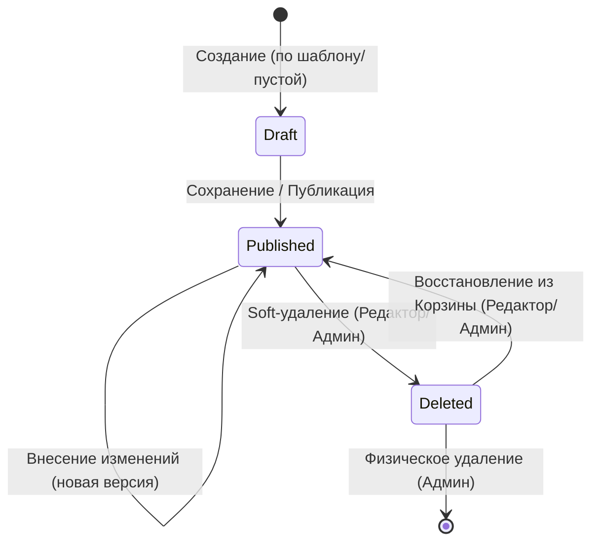

# Сущности и их жизненный цикл (Entities & Lifecycle)

## Основные сущности (Aggregates)

### 1. Пользователь (User)
Субъект системы, имеющий доступ к базе знаний.

* **Атрибуты:** 
  - `id` — уникальный идентификатор
  - `login` — логин для входа
  - `password_hash` — хеш пароля (BCrypt)
  - `email` — адрес электронной почты
  - `role` — глобальная роль (`Admin`, `Editor`, `Reader`)
  - `created_at` — дата создания
  - `updated_at` — дата последнего обновления

* **Связи:** 
  - Создает `Document`
  - Управляет `Space` (как владелец)
  - Имеет `SpacePermission` (права доступа к пространствам)
  - Создает `Version` (версии документов)
  - Загружает `Attachment` (вложения)

* **Примечание:** Пользователи не поддерживают soft-удаление. При необходимости блокировки доступа используется смена роли или организационные меры.

### 2. Пространство (Space)
Контейнер для документов с едиными настройками прав доступа.

* **Атрибуты:**
  - `id` — уникальный идентификатор
  - `name` — название пространства
  - `description` — описание
  - `owner_id` — ответственный редактор (ссылка на `User`)
  - `created_at` — дата создания
  - `updated_at` — дата последнего обновления

* **Связи:**
  - Содержит множество `Document`
  - Имеет множество `SpacePermission` (права доступа)
  - Принадлежит `User` (владельцу)

* **Примечание:** Пространства не поддерживают soft-удаление. Удаление пространства запрещено, если в нём есть документы (`ON DELETE RESTRICT`).

### 3. Право доступа к пространству (SpacePermission)
Назначает конкретному пользователю права на конкретное пространство.

* **Атрибуты:**
  - `id` — уникальный идентификатор
  - `space_id` — ссылка на `Space`
  - `user_id` — ссылка на `User`
  - `permission_type` — тип права (`READ`, `WRITE`, `OWNER`)
  - `granted_at` — дата выдачи права

* **Связи:**
  - Принадлежит `Space`
  - Принадлежит `User`

* **Примечание:** При удалении пользователя или пространства права доступа удаляются автоматически (`ON DELETE CASCADE`).

### 4. Документ (Document)
Центральная сущность системы, основная единица хранения информации.

* **Атрибуты:**
  - `id` — уникальный идентификатор
  - `title` — заголовок документа
  - `content` — содержимое в формате Wiki-разметки (Markdown)
  - `status` — статус жизненного цикла (`Draft`, `Published`, `Deleted`)
  - `is_deleted` — флаг мягкого удаления
  - `author_id` — ссылка на автора (`User`)
  - `space_id` — ссылка на пространство (`Space`)
  - `deleted_at` — дата мягкого удаления
  - `created_at` — дата создания
  - `updated_at` — дата последнего изменения

* **Связи:**
  - Принадлежит `Space`
  - Создан `User` (автором)
  - Имеет список `Attachment`
  - Имеет историю `Version`

* **Примечание:** Документы поддерживают soft-удаление (статус `Deleted`, флаг `is_deleted`).

### 5. Версия (Version)
Снимок состояния документа, связанный с Git-коммитом.

* **Атрибуты:**
  - `id` — уникальный идентификатор
  - `document_id` — ссылка на `Document`
  - `git_hash` — SHA-1 хэш коммита в Git-репозитории
  - `author_id` — ссылка на автора правки (`User`)
  - `comment` — сообщение коммита
  - `is_deleted` — флаг мягкого удаления
  - `created_at` — дата создания версии

* **Связи:**
  - Принадлежит `Document`
  - Создана `User` (автором)

* **Примечание:** Версии мягко удаляются каскадно вместе с документом.

### 6. Вложение (Attachment)
Файл, связанный с документом (изображения, PDF, архивы и т.д.).

* **Атрибуты:**
  - `id` — уникальный идентификатор
  - `document_id` — ссылка на `Document`
  - `filename` — оригинальное имя файла
  - `content_type` — MIME-тип
  - `size_bytes` — размер в байтах
  - `storage_path` — путь к файлу в blob-хранилище
  - `is_deleted` — флаг мягкого удаления
  - `uploaded_at` — дата загрузки
  - `uploaded_by` — ссылка на загрузившего пользователя (`User`)

* **Связи:**
  - Принадлежит `Document`
  - Загружено `User` (может быть NULL, если пользователь удалён)

* **Примечание:** Вложения мягко удаляются каскадно вместе с документом. Физические файлы хранятся в blob-хранилище.

---

## Жизненный цикл документа

### Описание переходов:

1. **Создание:** 
   - Документ инициализируется в статусе `Draft`
   - На этом этапе он виден только автору и администраторам
   - Создание происходит при выборе шаблона или создании пустого документа

2. **Публикация:** 
   - При первом сохранении или нажатии "Опубликовать" статус меняется на `Published`
   - Документ становится доступен для чтения всем пользователям, имеющим права доступа к соответствующему пространству

3. **Изменение:** 
   - Каждое сохранение в статусе `Published` создает новую запись в истории версий (Git-коммит)
   - Статус документа остается `Published`
   - Создается новая версия документа

4. **Soft-удаление:** 
   - Доступно редактору или администратору
   - Документ помечается флагом `is_deleted = TRUE`
   - Статус меняется на `Deleted`
   - Заполняется `deleted_at` (текущей датой и временем)
   - Документ перестает отображаться в общих списках и результатах поиска
   - Версии и вложения документа также мягко удаляются (каскадно через триггер)

5. **Восстановление:** 
   - Доступно редактору или администратору
   - Снимается флаг `is_deleted = FALSE`
   - Статус меняется на `Published`
   - Поле `deleted_at` очищается (становится NULL)
   - Документ снова доступен для чтения
   - Версии и вложения не восстанавливаются автоматически — требуется отдельная логика на уровне приложения

6. **Hard-delete (физическое удаление):** 
   - Доступно только администратору
   - Полностью удаляет документ, его версии и вложения из базы данных
   - Файлы из Git-репозитория и blob-хранилища должны быть удалены на уровне приложения отдельным сервисом
   - Используется в исключительных случаях, например, для окончательной очистки данных по истечении срока хранения в корзине
