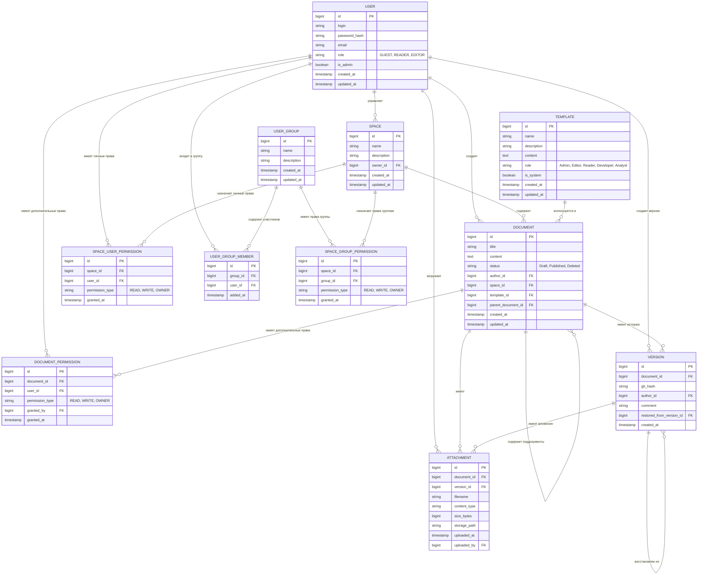

# Моделирование данных (Data Modeling)

## ER-диаграмма (Логическая модель)

## Описание таблиц

### 1. `users` — Пользователи системы

Хранит учетные данные, глобальные роли и флаг администратора.

| Столбец | Тип | Ограничения | Описание |
| :--- | :--- | :--- | :--- |
| `id` | `BIGSERIAL` | PRIMARY KEY | Уникальный идентификатор пользователя |
| `login` | `VARCHAR(100)` | NOT NULL, UNIQUE | Логин для входа в систему |
| `password_hash` | `VARCHAR(255)` | NOT NULL | Хеш пароля (BCrypt) |
| `email` | `VARCHAR(255)` | NOT NULL, UNIQUE | Адрес электронной почты |
| `role` | `VARCHAR(20)` | NOT NULL, CHECK (role IN ('GUEST', 'READER', 'EDITOR')) | Глобальная роль пользователя |
| `is_admin` | `BOOLEAN` | NOT NULL, DEFAULT FALSE | Флаг администратора. Дает доступ к панели администратора, управлению пользователями, группами, пространствами и правами доступа |
| `created_at` | `TIMESTAMP` | DEFAULT CURRENT_TIMESTAMP | Дата и время создания записи |
| `updated_at` | `TIMESTAMP` | DEFAULT CURRENT_TIMESTAMP | Дата и время последнего обновления |

**Индексы:**
- `PRIMARY KEY (id)`
- `UNIQUE (login)`
- `UNIQUE (email)`

**Примечания:**
- Каждый пользователь обязан иметь одну из трех ролей (`GUEST`, `READER`, `EDITOR`). Роль `GUEST` является базовой — она дает только возможность входа в систему.
- Флаг `is_admin` дает доступ к административным функциям независимо от роли.
- Комбинация `GUEST` + `is_admin = true` означает "чистого администратора" — он может управлять пользователями, группами и правами, но не имеет глобального доступа к контенту.
- Комбинация `EDITOR` + `is_admin = true` дает полный доступ и к контенту, и к администрированию.
- Для JWT-токена используются оба поля: claim `role` и claim `is_admin`.

---

### 2. `user_groups` — Группы пользователей

Хранит группы, созданные администратором для массового назначения прав на пространства.

| Столбец | Тип | Ограничения | Описание |
| :--- | :--- | :--- | :--- |
| `id` | `BIGSERIAL` | PRIMARY KEY | Уникальный идентификатор группы |
| `name` | `VARCHAR(200)` | NOT NULL, UNIQUE | Название группы |
| `description` | `TEXT` | | Описание группы |
| `created_at` | `TIMESTAMP` | DEFAULT CURRENT_TIMESTAMP | Дата и время создания |
| `updated_at` | `TIMESTAMP` | DEFAULT CURRENT_TIMESTAMP | Дата и время последнего обновления |

**Индексы:**
- `PRIMARY KEY (id)`
- `UNIQUE (name)`

**Примечания:**
- Группы создаются и управляются только администратором (`is_admin = true`).
- Группа не имеет владельца — управление полностью централизовано через администратора.
- При удалении группы (`ON DELETE CASCADE`) удаляются записи из `user_group_members` и `space_group_permissions`. Пользователи не затрагиваются.

---

### 3. `user_group_members` — Состав групп

Связь "многие-ко-многим" между пользователями и группами.

| Столбец | Тип | Ограничения | Описание |
| :--- | :--- | :--- | :--- |
| `id` | `BIGSERIAL` | PRIMARY KEY | Уникальный идентификатор связи |
| `group_id` | `BIGINT` | NOT NULL, FOREIGN KEY → `user_groups(id)` ON DELETE CASCADE | Группа |
| `user_id` | `BIGINT` | NOT NULL, FOREIGN KEY → `users(id)` ON DELETE CASCADE | Пользователь |
| `added_at` | `TIMESTAMP` | DEFAULT CURRENT_TIMESTAMP | Дата добавления в группу |

**Ограничения:**
- `UNIQUE(group_id, user_id)` — пользователь не может дважды входить в одну и ту же группу.

**Индексы:**
- `PRIMARY KEY (id)`
- `idx_user_group_members_group` на `(group_id)`
- `idx_user_group_members_user` на `(user_id)`

**Примечания:**
- При удалении пользователя все его связи с группами удаляются каскадно.
- При удалении группы все связи с участниками удаляются каскадно.

---

### 4. `spaces` — Пространства документов

Определяет логические группы документов (по проектам, отделам или темам) с едиными настройками прав доступа.

| Столбец | Тип | Ограничения | Описание |
| :--- | :--- | :--- | :--- |
| `id` | `BIGSERIAL` | PRIMARY KEY | Уникальный идентификатор пространства |
| `name` | `VARCHAR(200)` | NOT NULL, UNIQUE | Название пространства |
| `description` | `TEXT` | | Описание пространства |
| `owner_id` | `BIGINT` | NOT NULL, FOREIGN KEY → `users(id)` ON DELETE RESTRICT | Ответственный редактор |
| `created_at` | `TIMESTAMP` | DEFAULT CURRENT_TIMESTAMP | Дата и время создания |
| `updated_at` | `TIMESTAMP` | DEFAULT CURRENT_TIMESTAMP | Дата и время последнего обновления |

**Индексы:**
- `PRIMARY KEY (id)`
- `UNIQUE (name)`
- `idx_spaces_owner` на `(owner_id)`

---

### 5. `space_user_permissions` — Личные права пользователей на пространства

Обеспечивает разграничение прав доступа на уровне пространств для отдельных пользователей.

| Столбец | Тип | Ограничения | Описание |
| :--- | :--- | :--- | :--- |
| `id` | `BIGSERIAL` | PRIMARY KEY | Уникальный идентификатор записи прав |
| `space_id` | `BIGINT` | NOT NULL, FOREIGN KEY → `spaces(id)` ON DELETE CASCADE | Пространство |
| `user_id` | `BIGINT` | NOT NULL, FOREIGN KEY → `users(id)` ON DELETE CASCADE | Пользователь |
| `permission_type` | `VARCHAR(20)` | NOT NULL, CHECK (permission_type IN ('READ', 'WRITE', 'OWNER')) | Тип права |
| `granted_at` | `TIMESTAMP` | DEFAULT CURRENT_TIMESTAMP | Дата выдачи права |

**Ограничения:**
- `UNIQUE(space_id, user_id, permission_type)`

**Индексы:**
- `PRIMARY KEY (id)`
- `idx_space_user_permissions_space` на `(space_id)`
- `idx_space_user_permissions_user` на `(user_id)`

---

### 6. `space_group_permissions` — Права групп на пространства

Обеспечивает разграничение прав доступа на уровне пространств для групп пользователей.

| Столбец | Тип | Ограничения | Описание |
| :--- | :--- | :--- | :--- |
| `id` | `BIGSERIAL` | PRIMARY KEY | Уникальный идентификатор записи прав |
| `space_id` | `BIGINT` | NOT NULL, FOREIGN KEY → `spaces(id)` ON DELETE CASCADE | Пространство |
| `group_id` | `BIGINT` | NOT NULL, FOREIGN KEY → `user_groups(id)` ON DELETE CASCADE | Группа |
| `permission_type` | `VARCHAR(20)` | NOT NULL, CHECK (permission_type IN ('READ', 'WRITE', 'OWNER')) | Тип права |
| `granted_at` | `TIMESTAMP` | DEFAULT CURRENT_TIMESTAMP | Дата выдачи права |

**Ограничения:**
- `UNIQUE(space_id, group_id, permission_type)`

**Индексы:**
- `PRIMARY KEY (id)`
- `idx_space_group_permissions_space` на `(space_id)`
- `idx_space_group_permissions_group` на `(group_id)`

**Примечания:**
- При удалении группы все её права на пространства удаляются каскадно.

---

### 7. `templates` — Шаблоны документов

Хранит предустановленные шаблоны для различных ролей пользователей.

| Столбец | Тип | Ограничения | Описание |
| :--- | :--- | :--- | :--- |
| `id` | `BIGSERIAL` | PRIMARY KEY | Уникальный идентификатор шаблона |
| `name` | `VARCHAR(200)` | NOT NULL, UNIQUE | Название шаблона |
| `description` | `TEXT` | | Описание шаблона |
| `content` | `TEXT` | NOT NULL | Содержимое шаблона в Markdown |
| `role` | `VARCHAR(20)` | NOT NULL, CHECK (role IN ('Admin', 'Editor', 'Reader', 'Developer', 'Analyst')) | Роль, для которой доступен шаблон |
| `is_system` | `BOOLEAN` | NOT NULL, DEFAULT TRUE | Системный шаблон (нельзя изменить/удалить) |
| `created_at` | `TIMESTAMP` | DEFAULT CURRENT_TIMESTAMP | Дата создания |
| `updated_at` | `TIMESTAMP` | DEFAULT CURRENT_TIMESTAMP | Дата обновления |

**Индексы:**
- `PRIMARY KEY (id)`
- `UNIQUE (name)`
- `idx_templates_role` на `(role)`

---

### 8. `documents` — Документы

Основная таблица контента. Хранит текст документов в формате Wiki-разметки (Markdown) и управляет их жизненным циклом.

| Столбец | Тип | Ограничения | Описание |
| :--- | :--- | :--- | :--- |
| `id` | `BIGSERIAL` | PRIMARY KEY | Уникальный идентификатор документа |
| `title` | `VARCHAR(500)` | NOT NULL | Заголовок документа |
| `content` | `TEXT` | | Содержимое документа в Markdown |
| `status` | `VARCHAR(20)` | NOT NULL, DEFAULT 'Draft', CHECK (status IN ('Draft', 'Published', 'Deleted')) | Статус жизненного цикла. При переходе в `Deleted` документ считается мягко удалённым и скрывается из результатов поиска и списков, но физически остаётся в БД и Git-репозитории. |
| `author_id` | `BIGINT` | NOT NULL, FOREIGN KEY → `users(id)` ON DELETE RESTRICT | Автор документа |
| `space_id` | `BIGINT` | NOT NULL, FOREIGN KEY → `spaces(id)` ON DELETE RESTRICT | Принадлежность к пространству |
| `template_id` | `BIGINT` | FOREIGN KEY → `templates(id)` ON DELETE SET NULL | Использованный шаблон |
| `parent_document_id` | `BIGINT` | FOREIGN KEY → `documents(id)` ON DELETE CASCADE | Родительский документ |
| `created_at` | `TIMESTAMP` | DEFAULT CURRENT_TIMESTAMP | Дата создания |
| `updated_at` | `TIMESTAMP` | DEFAULT CURRENT_TIMESTAMP | Дата последнего изменения (включая изменение статуса). |

**Индексы:**
- `PRIMARY KEY (id)`
- `idx_documents_space_status` на `(space_id, status) WHERE status != 'Deleted'`
- `idx_documents_published` на `(status) WHERE status = 'Published'`
- `idx_documents_author` на `(author_id)`
- `idx_documents_created_at` на `(created_at)`
- `idx_documents_updated_at` на `(updated_at)`

**Примечания:**
- Документы поддерживают soft-удаление через перевод в статус `Deleted`. Все связанные данные (версии, вложения) при этом сохраняются.
- Физическое удаление (hard-delete) выполняется администратором через специальную функцию в панели администратора (раздел "Корзина").
- При переходе в статус `Deleted` поле `updated_at` автоматически обновляется, фиксируя время удаления.

---

### 9. `versions` — Версии документов

Служит для связи метаданных документа с физическими коммитами в Git-репозитории.

| Столбец | Тип | Ограничения | Описание |
| :--- | :--- | :--- | :--- |
| `id` | `BIGSERIAL` | PRIMARY KEY | Уникальный идентификатор версии |
| `document_id` | `BIGINT` | NOT NULL, FOREIGN KEY → `documents(id)` ON DELETE RESTRICT | Документ |
| `git_hash` | `VARCHAR(40)` | NOT NULL | SHA-1 хэш коммита в Git |
| `author_id` | `BIGINT` | NOT NULL, FOREIGN KEY → `users(id)` ON DELETE RESTRICT | Автор изменения |
| `comment` | `VARCHAR(500)` | | Сообщение коммита |
| `restored_from_version_id` | `BIGINT` | FOREIGN KEY → `versions(id)` ON DELETE SET NULL | Версия, из которой выполнен откат |
| `created_at` | `TIMESTAMP` | DEFAULT CURRENT_TIMESTAMP | Дата создания версии |

**Индексы:**
- `PRIMARY KEY (id)`
- `idx_versions_document` на `(document_id)`
- `idx_versions_git_hash` на `(git_hash)`
- `idx_versions_author` на `(author_id)`

**Примечание:** Версии удаляются каскадно вместе с документом при `hard-delete`. При `soft-delete` (статус `Deleted`) версии сохраняются и доступны для просмотра администратором.

---

### 10. `attachments` — Вложения

Хранит метаданные файлов, прикреплённых к документам, с возможностью привязки к конкретной версии.

| Столбец | Тип | Ограничения | Описание |
| :--- | :--- | :--- | :--- |
| `id` | `BIGSERIAL` | PRIMARY KEY | Уникальный идентификатор вложения |
| `document_id` | `BIGINT` | NOT NULL, FOREIGN KEY → `documents(id)` ON DELETE RESTRICT | Документ-владелец |
| `version_id` | `BIGINT` | FOREIGN KEY → `versions(id)` ON DELETE CASCADE | Версия документа (NULL = актуальное) |
| `filename` | `VARCHAR(255)` | NOT NULL | Оригинальное имя файла |
| `content_type` | `VARCHAR(100)` | | MIME-тип файла |
| `size_bytes` | `BIGINT` | NOT NULL | Размер файла в байтах |
| `storage_path` | `VARCHAR(500)` | NOT NULL | Путь в blob-хранилище |
| `uploaded_at` | `TIMESTAMP` | DEFAULT CURRENT_TIMESTAMP | Дата загрузки |
| `uploaded_by` | `BIGINT` | FOREIGN KEY → `users(id)` ON DELETE SET NULL | Кто загрузил |

**Индексы:**
- `PRIMARY KEY (id)`
- `idx_attachments_document` на `(document_id)`
- `idx_attachments_version` на `(version_id)`
- `idx_attachments_uploaded_by` на `(uploaded_by)`

**Примечание:** Вложения удаляются каскадно вместе с документом при `hard-delete`. При `soft-delete` документа вложения сохраняются.

---

### 11. `document_permissions` — Права доступа на уровне документа

Позволяет назначать дополнительные права на конкретный документ поверх прав пространства.

| Столбец | Тип | Ограничения | Описание |
| :--- | :--- | :--- | :--- |
| `id` | `BIGSERIAL` | PRIMARY KEY | Уникальный идентификатор записи прав |
| `document_id` | `BIGINT` | NOT NULL, FOREIGN KEY → `documents(id)` ON DELETE CASCADE | Документ |
| `user_id` | `BIGINT` | NOT NULL, FOREIGN KEY → `users(id)` ON DELETE CASCADE | Пользователь |
| `permission_type` | `VARCHAR(20)` | NOT NULL, CHECK (permission_type IN ('READ', 'WRITE', 'OWNER')) | Тип права |
| `granted_by` | `BIGINT` | FOREIGN KEY → `users(id)` ON DELETE SET NULL | Кто выдал право |
| `granted_at` | `TIMESTAMP` | DEFAULT CURRENT_TIMESTAMP | Дата выдачи права |

**Ограничения:**
- `UNIQUE(document_id, user_id, permission_type)`

**Индексы:**
- `PRIMARY KEY (id)`
- `idx_doc_permissions_document` на `(document_id)`
- `idx_doc_permissions_user` на `(user_id)`

---

## Связи между таблицами

| Родительская таблица | Дочерняя таблица | Внешний ключ | ON DELETE | Обоснование |
| :--- | :--- | :--- | :--- | :--- |
| `users` | `documents` | `author_id` | `RESTRICT` | Нельзя удалить пользователя-автора |
| `users` | `spaces` | `owner_id` | `RESTRICT` | Нельзя удалить владельца пространства |
| `users` | `space_user_permissions` | `user_id` | `CASCADE` | Права не нужны без пользователя |
| `users` | `user_group_members` | `user_id` | `CASCADE` | Связь с группой не нужна без пользователя |
| `users` | `versions` | `author_id` | `RESTRICT` | Нельзя удалить автора версий |
| `users` | `attachments` | `uploaded_by` | `SET NULL` | Вложения остаются, автор неизвестен |
| `users` | `document_permissions` | `user_id` | `CASCADE` | Права не нужны без пользователя |
| `users` | `document_permissions` | `granted_by` | `SET NULL` | История выдачи прав сохраняется |
| `user_groups` | `user_group_members` | `group_id` | `CASCADE` | Состав не нужен без группы |
| `user_groups` | `space_group_permissions` | `group_id` | `CASCADE` | Права не нужны без группы |
| `spaces` | `documents` | `space_id` | `RESTRICT` | Нельзя удалить пространство с документами |
| `spaces` | `space_user_permissions` | `space_id` | `CASCADE` | Права не нужны без пространства |
| `spaces` | `space_group_permissions` | `space_id` | `CASCADE` | Права не нужны без пространства |
| `templates` | `documents` | `template_id` | `SET NULL` | При удалении шаблона документы остаются |
| `documents` | `documents` | `parent_document_id` | `CASCADE` | При удалении родителя удаляются поддокументы |
| `documents` | `versions` | `document_id` | `RESTRICT` | Физическое удаление только через hard-delete |
| `documents` | `attachments` | `document_id` | `RESTRICT` | Физическое удаление только через hard-delete |
| `documents` | `document_permissions` | `document_id` | `CASCADE` | Права не нужны без документа |
| `versions` | `versions` | `restored_from_version_id` | `SET NULL` | История откатов сохраняется |
| `versions` | `attachments` | `version_id` | `CASCADE` | Вложения не нужны без версии |