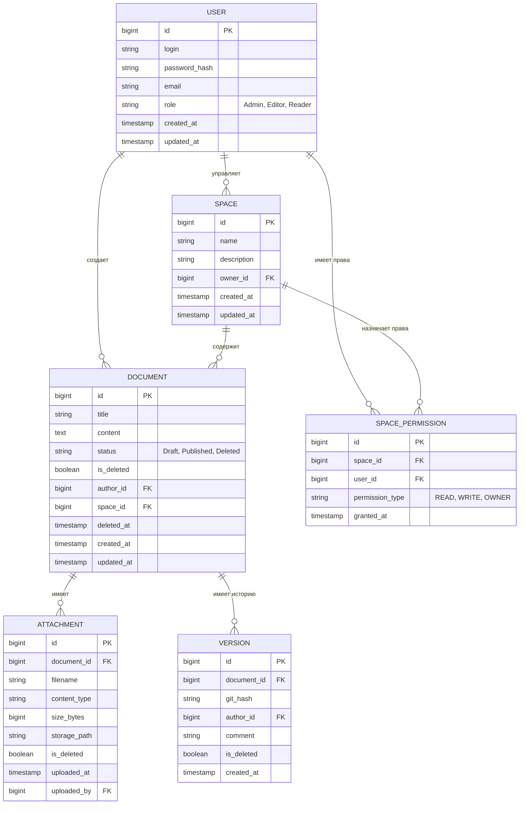

# Моделирование данных (Data Modeling)

## ER-диаграмма (Логическая модель)

## Описание таблиц

### 1. `users` — Пользователи системы

Хранит учетные данные и глобальные роли пользователей.

| Столбец | Тип | Ограничения | Описание |
| :--- | :--- | :--- | :--- |
| `id` | `BIGSERIAL` | PRIMARY KEY | Уникальный идентификатор пользователя |
| `login` | `VARCHAR(100)` | NOT NULL, UNIQUE | Логин для входа в систему |
| `password_hash` | `VARCHAR(255)` | NOT NULL | Хеш пароля (BCrypt) |
| `email` | `VARCHAR(255)` | NOT NULL, UNIQUE | Адрес электронной почты |
| `role` | `VARCHAR(20)` | NOT NULL, CHECK (role IN ('Admin', 'Editor', 'Reader')) | Глобальная роль пользователя |
| `created_at` | `TIMESTAMP` | DEFAULT CURRENT_TIMESTAMP | Дата и время создания записи |
| `updated_at` | `TIMESTAMP` | DEFAULT CURRENT_TIMESTAMP | Дата и время последнего обновления |

**Индексы:**
- `PRIMARY KEY (id)`
- `UNIQUE (login)`
- `UNIQUE (email)`
- `idx_users_role` на `(role)` — для фильтрации по ролям

---

### 2. `spaces` — Пространства документов

Определяет логические группы документов (по проектам, отделам или темам) с едиными настройками прав доступа.

| Столбец | Тип | Ограничения | Описание |
| :--- | :--- | :--- | :--- |
| `id` | `BIGSERIAL` | PRIMARY KEY | Уникальный идентификатор пространства |
| `name` | `VARCHAR(200)` | NOT NULL, UNIQUE | Название пространства |
| `description` | `TEXT` | | Описание пространства (назначение, состав документов) |
| `owner_id` | `BIGINT` | NOT NULL, FOREIGN KEY → `users(id)` ON DELETE RESTRICT | Ответственный редактор (пользователь с правами Editor или Admin) |
| `created_at` | `TIMESTAMP` | DEFAULT CURRENT_TIMESTAMP | Дата и время создания |
| `updated_at` | `TIMESTAMP` | DEFAULT CURRENT_TIMESTAMP | Дата и время последнего обновления |

**Индексы:**
- `PRIMARY KEY (id)`
- `UNIQUE (name)`
- `idx_spaces_owner` на `(owner_id)` — для поиска пространств по ответственному

---

### 3. `space_permissions` — Права доступа к пространствам

Обеспечивает разграничение прав доступа на уровне пространств между пользователями. Позволяет назначать отдельные права на чтение, запись или полный контроль для каждого пользователя в рамках конкретного пространства.

| Столбец | Тип | Ограничения | Описание |
| :--- | :--- | :--- | :--- |
| `id` | `BIGSERIAL` | PRIMARY KEY | Уникальный идентификатор записи прав |
| `space_id` | `BIGINT` | NOT NULL, FOREIGN KEY → `spaces(id)` ON DELETE CASCADE | Пространство, к которому предоставляется доступ |
| `user_id` | `BIGINT` | NOT NULL, FOREIGN KEY → `users(id)` ON DELETE CASCADE | Пользователь, которому предоставляется доступ |
| `permission_type` | `VARCHAR(20)` | NOT NULL, CHECK (permission_type IN ('READ', 'WRITE', 'OWNER')) | Тип права: READ — чтение, WRITE — создание/редактирование, OWNER — полный контроль |
| `granted_at` | `TIMESTAMP` | DEFAULT CURRENT_TIMESTAMP | Дата и время выдачи права |

**Ограничения:**
- `UNIQUE(space_id, user_id, permission_type)` — у одного пользователя не может быть двух одинаковых прав на одно пространство

**Индексы:**
- `PRIMARY KEY (id)`
- `idx_space_permissions_space` на `(space_id)` — для получения всех прав пространства
- `idx_space_permissions_user` на `(user_id)` — для получения всех прав пользователя
- `idx_space_permissions_type` на `(permission_type)` — для фильтрации по типу прав

---

### 4. `documents` — Документы

Основная таблица контента. Хранит текст документов в формате Wiki-разметки (Markdown) и управляет их жизненным циклом.

| Столбец | Тип | Ограничения | Описание |
| :--- | :--- | :--- | :--- |
| `id` | `BIGSERIAL` | PRIMARY KEY | Уникальный идентификатор документа |
| `title` | `VARCHAR(500)` | NOT NULL | Заголовок документа |
| `content` | `TEXT` | | Содержимое документа в формате Wiki-разметки (Markdown) |
| `status` | `VARCHAR(20)` | NOT NULL, DEFAULT 'Draft', CHECK (status IN ('Draft', 'Published', 'Deleted')) | Статус жизненного цикла: Draft — черновик, Published — опубликован, Deleted — в корзине |
| `is_deleted` | `BOOLEAN` | NOT NULL, DEFAULT FALSE | Флаг мягкого удаления (дублирует статус Deleted для удобства фильтрации) |
| `author_id` | `BIGINT` | NOT NULL, FOREIGN KEY → `users(id)` ON DELETE RESTRICT | Автор документа (создатель) |
| `space_id` | `BIGINT` | NOT NULL, FOREIGN KEY → `spaces(id)` ON DELETE RESTRICT | Принадлежность к пространству |
| `deleted_at` | `TIMESTAMP` | | Дата и время мягкого удаления (заполняется автоматически при is_deleted = TRUE) |
| `created_at` | `TIMESTAMP` | DEFAULT CURRENT_TIMESTAMP | Дата и время создания документа |
| `updated_at` | `TIMESTAMP` | DEFAULT CURRENT_TIMESTAMP | Дата и время последнего изменения |

**Индексы:**
- `PRIMARY KEY (id)`
- `idx_documents_space_status` на `(space_id, status) WHERE is_deleted = FALSE` — для быстрого поиска активных документов в пространстве
- `idx_documents_author` на `(author_id)` — для поиска документов по автору
- `idx_documents_not_deleted` на `(is_deleted) WHERE is_deleted = FALSE` — для фильтрации неудалённых документов
- `idx_documents_created_at` на `(created_at)` — для сортировки по дате создания
- `idx_documents_updated_at` на `(updated_at)` — для сортировки по дате изменения

---

### 5. `versions` — Версии документов

Служит для связи метаданных документа с физическими коммитами в Git-репозитории. Каждая запись соответствует одному коммиту в Git, где хранится .md-файл документа.

| Столбец | Тип | Ограничения | Описание |
| :--- | :--- | :--- | :--- |
| `id` | `BIGSERIAL` | PRIMARY KEY | Уникальный идентификатор записи версии |
| `document_id` | `BIGINT` | NOT NULL, FOREIGN KEY → `documents(id)` ON DELETE RESTRICT | Документ, к которому относится версия |
| `git_hash` | `VARCHAR(40)` | NOT NULL | Полный SHA-1 хэш коммита в Git-репозитории |
| `author_id` | `BIGINT` | NOT NULL, FOREIGN KEY → `users(id)` ON DELETE RESTRICT | Автор изменения (пользователь, сделавший коммит) |
| `comment` | `VARCHAR(500)` | | Сообщение коммита (описание изменений) |
| `is_deleted` | `BOOLEAN` | NOT NULL, DEFAULT FALSE | Флаг мягкого удаления (при удалении документа) |
| `created_at` | `TIMESTAMP` | DEFAULT CURRENT_TIMESTAMP | Дата и время создания версии (время коммита) |

**Индексы:**
- `PRIMARY KEY (id)`
- `idx_versions_document` на `(document_id)` — для получения истории версий документа
- `idx_versions_git_hash` на `(git_hash)` — для поиска по хэшу коммита
- `idx_versions_author` на `(author_id)` — для поиска версий по автору
- `idx_versions_created_at` на `(created_at)` — для сортировки по времени

---

### 6. `attachments` — Вложения

Хранит метаданные файлов, прикреплённых к документам. Сами файлы физически располагаются в blob-хранилище (отдельная директория на файловой системе), а в базе данных сохраняется только путь к ним.

| Столбец | Тип | Ограничения | Описание |
| :--- | :--- | :--- | :--- |
| `id` | `BIGSERIAL` | PRIMARY KEY | Уникальный идентификатор вложения |
| `document_id` | `BIGINT` | NOT NULL, FOREIGN KEY → `documents(id)` ON DELETE RESTRICT | Документ-владелец (к которому прикреплён файл) |
| `filename` | `VARCHAR(255)` | NOT NULL | Оригинальное имя файла |
| `content_type` | `VARCHAR(100)` | | MIME-тип файла (например, image/png, application/pdf, text/plain) |
| `size_bytes` | `BIGINT` | NOT NULL | Размер файла в байтах |
| `storage_path` | `VARCHAR(500)` | NOT NULL | Относительный или абсолютный путь к файлу в blob-хранилище |
| `is_deleted` | `BOOLEAN` | NOT NULL, DEFAULT FALSE | Флаг мягкого удаления (при удалении документа) |
| `uploaded_at` | `TIMESTAMP` | DEFAULT CURRENT_TIMESTAMP | Дата и время загрузки файла |
| `uploaded_by` | `BIGINT` | FOREIGN KEY → `users(id)` ON DELETE SET NULL | Пользователь, загрузивший файл (может быть NULL, если пользователь удалён) |

**Индексы:**
- `PRIMARY KEY (id)`
- `idx_attachments_document` на `(document_id)` — для получения всех вложений документа
- `idx_attachments_uploaded_by` на `(uploaded_by)` — для поиска вложений по загрузившему пользователю
- `idx_attachments_content_type` на `(content_type)` — для фильтрации по типу файлов

---

## Связи между таблицами

| Родительская таблица | Дочерняя таблица | Внешний ключ | ON DELETE | Обоснование |
| :--- | :--- | :--- | :--- | :--- |
| `users` | `documents` | `author_id` | `RESTRICT` | Нельзя удалить пользователя, если он автор документов |
| `users` | `spaces` | `owner_id` | `RESTRICT` | Нельзя удалить пользователя, если он владелец пространства |
| `users` | `space_permissions` | `user_id` | `CASCADE` | Права доступа не нужны без пользователя |
| `users` | `versions` | `author_id` | `RESTRICT` | Нельзя удалить пользователя, если он создавал версии |
| `users` | `attachments` | `uploaded_by` | `SET NULL` | При удалении пользователя вложения остаются, но автор становится неизвестен |
| `spaces` | `documents` | `space_id` | `RESTRICT` | Нельзя удалить пространство, если в нём есть документы |
| `spaces` | `space_permissions` | `space_id` | `CASCADE` | Права доступа не нужны без пространства |
| `documents` | `versions` | `document_id` | `RESTRICT` | Физическое удаление только через hard-delete функцию |
| `documents` | `attachments` | `document_id` | `RESTRICT` | Физическое удаление только через hard-delete функцию |

---